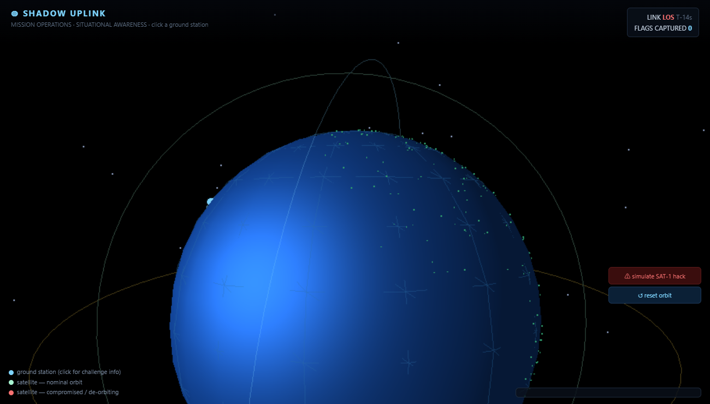
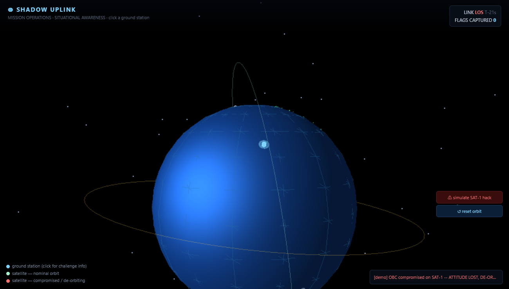

# DEEP SAT EXPLOIT

**A full-chain satellite pwn CTF — from a ground-station login page all the way to code execution on a spacecraft's on-board computer.**



## About

**DEEP SAT EXPLOIT** is a four-stage capture-the-flag challenge that walks an attacker down the *entire command path of a space mission* — public web of a ground station → authenticated command uplink → radio pass → flight-software command router → memory of a flight app running on the on-board computer (OBC).

You never touch the spacecraft directly. Just like a real mission, the only route "up" is **through** the ground segment and a narrow radio-visibility window, so each layer's compromise becomes the credential for the next. That turns four bugs into **one escalating story** instead of four disconnected tasks:

> web session ⟶ command authority ⟶ bus routing ⟶ app memory safety

The finale is a **memory-corruption sandbox escape across the flight software's Software Bus** — deliberately isomorphic to a browser/OS **IPC-message sandbox escape**, except here the "sandbox" is a [NASA cFS](https://github.com/nasa/cFS)-style flight app and the "IPC" is the spacecraft Software Bus. Same structure you'd see popping a renderer out of a browser sandbox — but it's a satellite.

The whole mission is wired to a **live 3D situational-awareness globe**. Ground stations are clickable (challenge connection info + target status); satellites orbit in real time; and the moment a team lands code execution on an OBC, that satellite **loses attitude control, spirals in, and burns up on reentry** right on the map.

Everything is built on the shape of real systems — [Yamcs](https://github.com/yamcs/yamcs) for the ground segment and [NASA cFS](https://github.com/nasa/cFS) for the flight software — with a simplified but faithful CCSDS telecommand format, so players learn the actual command path, not a toy.

> ⚠️ **Deliberately vulnerable software for education / CTF use.** Do not expose it to the public internet.

## The full chain — ground station → satellite

You start with nothing but a browser pointed at a ground station, and you finish with a shell-equivalent on a spacecraft. Each step unlocks the next:

1. **[GROUND ZERO] Break into mission control.** The ground station's session is a JWT, and the verifier trusts `alg:none`. Forge an unsigned `role=operator` token to unlock the command console — and with it, the **uplink authentication key** and a **download of the flight firmware image** (the very binary you'll pwn later).

2. **[SIGNAL PASS] Ride the pass.** The uplink relay is the only bridge to the spacecraft, and it models a real LEO overpass: **~15 s of AOS** (acquisition of signal) when commands get through, then **~45 s of LOS** when everything is dropped. Frame a valid **CCSDS telecommand** and deliver it inside the window.

3. **[BUS HIJACK] Confuse the command router.** The cFS-style flight software routes commands to apps by their **full 11-bit message id**, but authorizes them using only the **truncated low byte**. A privileged app whose low byte collides with an unrestricted one becomes reachable from a raw uplink — a classic parser-differential / route-confusion bug.

4. **[OBC ESCAPE] Escape the flight-app sandbox.** One of those now-reachable privileged apps copies your command payload into a fixed stack buffer with **no bounds check**. Overflow the saved return address (`-no-pie`, no stack canary, symbols intact) and **ret2win into the core flight-executive routine** only the boot path should ever reach. That's code execution on the OBC — and on the globe, the satellite drops out of the sky.

```
  ┌────────────┐   HTTP     ┌──────────────┐   CCSDS/TC    ┌───────────────┐   Software Bus   ┌──────────────┐
  │  attacker  │ ─────────▶ │ ground       │ ───(15s AOS)─▶│ uplink relay  │ ────(msgid)────▶ │  flight SW    │
  │            │            │ station web  │               │ (visibility)  │                  │  (cFS-like)   │
  └────────────┘            └──────────────┘               └───────────────┘                  └──────────────┘
     stage 1 [GROUND ZERO]: alg=none JWT → operator     stage 2 [SIGNAL PASS]: ride the pass    stage 3a [BUS HIJACK]: ACL route confusion
     stage 1 [GROUND ZERO]: pull firmware + uplink key                                           stage 3b [OBC ESCAPE]: memcpy overflow → sandbox escape
```

Compromising the OBC (stage 3b) makes **SAT-1 spiral out of orbit and burn up** on the 3D mission-ops globe:



## Run it

```bash
docker compose up --build
```

| Surface | URL / endpoint | Role |
|---|---|---|
| Ground station (web mission control) | http://localhost:8080 | **start here** |
| Uplink relay (raw TCP) | `localhost:9010` | stage 2+ |
| Scoreboard + 3D globe GUI | http://localhost:8000 | watch the mission, submit flags |

The `flight-sw` OBC is **not** directly reachable — it only speaks to the relay over the internal `spacelink` network, just like a real spacecraft behind a ground station.

## The 3D globe

Open **http://localhost:8000**. A rotating Earth shows the ground stations (cyan pins) and little solar-panelled satellites on their orbits.

- **Click a ground station** → connection info for its challenge and the status of the satellite it commands.
- **Solve the chain** (or hit the *demo* button) → the target satellite's OBC is flagged compromised, its orbit decays, and it de-orbits with a fiery reentry trail.
- Drag to rotate, scroll to zoom.

## Stages

| # | Stage Label | Where | Bug class | Flag |
|---|---|---|---|---|
| 1 | **GROUND ZERO** | ground station | JWT `alg:none` auth bypass → operator | `SATCTF{...alg_n0ne}` |
| 2 | **SIGNAL PASS** | uplink relay | timing: craft a valid CCSDS TC inside the 15s AOS window | `SATCTF{...15s_w1nd0w}` |
| 3a | **BUS HIJACK** | flight SW | Software Bus ACL indexed by truncated msgid (route confusion) | `SATCTF{...route_c0nfus10n}` |
| 3b | **OBC ESCAPE** | flight SW | unbounded `memcpy` in a sandboxed app → ret2win into the core executive | `SATCTF{...sandb0x_3scap3}` |

Submit flags at the scoreboard: `POST http://localhost:8000/api/submit` with JSON `{"team":"you","flag":"SATCTF{...}"}`. The final flag de-orbits the sat.

## Reference solution

A complete, dependency-free exploit chain lives in [`solution/exploit.py`](solution/exploit.py):

```bash
cd solution
python3 exploit.py --host localhost
```

It forges the operator token, pulls the firmware, resolves the ret2win address from the ELF, and rides the visibility window through all four stages.

See [`DESIGN.md`](DESIGN.md) for the full organizer writeup (every bug, why it exists, and how to fix it).

## Layout

```
ground-station/   Stage 1  — Yamcs-inspired Flask mission control (JWT alg:none)
uplink/           Stage 2  — visibility-window relay + CCSDS validation
flight-sw/        Stage 3  — cFS-style OBC in C (route confusion + stack overflow)
scoreboard/       scoreboard API + 3D globe GUI (Three.js)
solution/         reference full-chain exploit
config/           mission.json — satellites, ground stations, flags, window
docs/             screenshots
```

## Tuning

- Visibility window: `AOS_SECONDS` / `LOS_SECONDS` on the `uplink-relay` service (and `visibility_window` in `config/mission.json` for the GUI clock).
- Flags: edit `docker-compose.yml` (service env) **and** `config/mission.json` (scoreboard) together — they must match.
- GUI weight: tune `RENDER_SCALE` and `FPS` at the top of [`scoreboard/web/app.js`](scoreboard/web/app.js).
- Offline venues: drop `three.min.js` into `scoreboard/web/vendor/` so the GUI doesn't reach the CDN.
